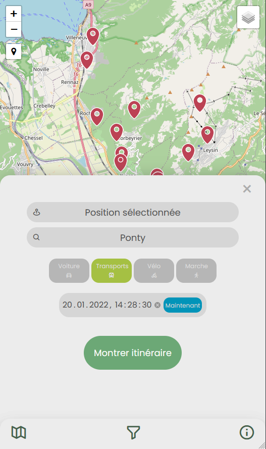
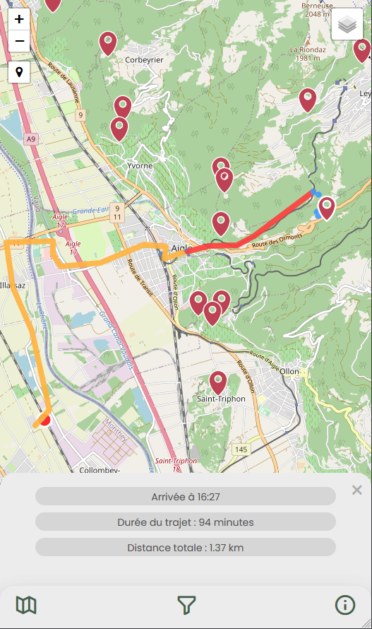
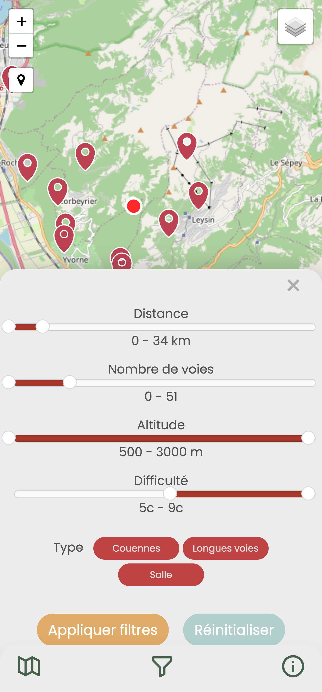
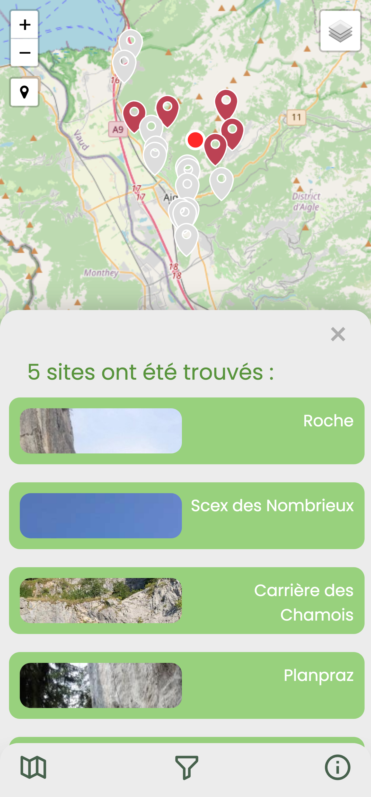

# Climbing in the Swiss Chablais

## 1. Objectif de l'application

Ce projet a été réalisé dans le cadre du cours Géovisualisation dynamique et traitement de données donné par Pr. Christian Kaiser à l'Univsersité  de Lausanne.

L'idée de ce projet était de réaliser une application de cartographie interactive portant sur les différents lieux de grimpe qui se trouvent dans le Chablais suisse. Cette application permet ainsi à l'utilisateur de repérer les différents lieux de grimpe présents dans cette région et d'interagir de plusieurs manières avec ceux-ci :

* un itinéraire entre un lieu choisi et les différents spots de grimpe peut être rapidement calculé. Plusieurs options sont possibles, telles que le mode de transport, la date ou l'heure de transport

* un filtrage des lieux, selon la difficulté, la distance l'altitude, etc ... est possible

* des informations supplémentaires pour chaque spot de grimpe sont disponibles, avec une photo, une description, etc ...

## 2. Application réalisée

### 2.1 Description générale

### 2.2 Système GPS

#### Open Trip Planner (OTP)

[Open Trip Planner](http://docs.opentripplanner.org/en/latest/) est un planificateur multi-modal de trajet. Il s'agit d'un projet open source qui a commencé en 2009 à l'issue d'un work shop à Portland (Oregon). David Emory, Brian Ferris et Brandon Martin-Anderson en sont les trois principaux fondateurs. Le projet a connu un développement rapide et de un nombre d'utilisateurs croissant. Une deuxième version (OpenTripPlanner 2) a vu le jour en 2020. La communauté est encore active aujourd'hui et continue de développer le projet.

OTP est un programme Java et nécessite plusieurs fichiers externes afin de fonctionner, à savoir :
* Trois fichiers JSON qui définissent les paramètres du serveur monté
* Un fichier [GTFS](https://opentransportdata.swiss/fr/cookbook/gtfs/) contenant les horaires des transports publics (ici pour la Suisse)
* Un fichier [PBF](https://download.geofabrik.de/europe/switzerland.html) de la Suisse contenant toutes les informations mises à disposition par OSM pour le territoire voulu
* Un fichier [JAR](https://repo1.maven.org/maven2/org/opentripplanner/otp/2.0.0/) contenant le programme en Java d'OTP
* Deux fichiers `.obj` qui représentent le réseau de transport calculé grâce aux fichier GTFS, PBF par le biai du programme OTP (le fichier `.jar`). Ces fichiers `.obj` peuvent être sauvegardé afin de monter plus rapidement le serveur par la suite.

#### Problèmes rencontrés lors de l'implémentation d'OTP

* 1. Installer la bonne version de Java
    * Après plusieurs essais, il s'est avéré préférable d'utiliser la version 11 de Java et non une plus récente

* 2. Monter le serveur OTP
    * Fichier PBF: il a fallu d'abord utiliser un fichier PBF qui concernait notre zone d'étude. Ces fichiers contiennent énormément d'informations et sont donc très volumineux. Plus le fichier est volumineux, plus le programme demande une performance croissante de la machine (surtout par rapport à la mémoire vive). Puisque nous ne possédons pas de machine assez puissante, nous avons dû restreindre notre zone d'étude au Chablais avec [Osmium](https://osmcode.org/osmium-tool/manual.html#creating-geographic-extracts).
    * Fichier GTFS : les fichiers GTFS mis à disposition par OpenTransportData.swiss ont dû être modifié car le type de route n°1700 n'était pas reconnu par OTP. Il a été manuellement remplacé par le n°1300 afin qu'OTP le prenne en compte. Ce problème a déjà été indiqué à la communauté OTP [ici](https://github.com/opentripplanner/OpenTripPlanner/issues/2654).

    Pour les données 2022, les fichiers d'OpenTransportData ne fonctionnaient plus car un type d'agence dans le fichier `agency.txt` manquait. Nous avons donc utiliser un fichier GTFS mise à disposition par [geOps](https://gtfs.geops.ch/).

#### Utilisation d'OTP

Afin d'utiliser notre application, il est nécessaire de monter un serveur OTP en local. Toutes les étapes nécessaires sont décrites ici :

* Assurez vous d'avoir la [version 11 de Java](https://www.oracle.com/java/technologies/javase/jdk11-archive-downloads.html). Vous pouvez vérifier votre version de Java en tapant `java -version` dans un terminal.

* [Téléchargez](https://drive.google.com/drive/folders/1F7Za8H5Ypwcle5aLj8_TLj5-Om-KLPgT?usp=sharing) le dossier compressé contenant l'ensemble des fichiers nécessaires à monter le serveur OTP.

* Extrayez l'ensemble des fichiers à l'emplacement de votre choix.

* Ouvrez un terminal sur votre machine.

* Changez le répertoire pour le dossier que vous avez téléchargé précédemment.

* Une fois dans le dossier, écrivez simplement :

`java -Xmx8G -jar otp_shaded.jar --load .`

`java` indique que vous allez utiliser un programme écrit dans le langage\
`-Xmx8G` indique la quantité de mémoire vive que vous souhaitez allouer au programme (ici 8Go)\
`-jar` indique le type de fichier qui va être lu\
`otp_shaded.jar` correspond au programme OTP qui sera lu et exécuté\
`--load` charge les fichiers `.obj` préalablement créés\
`.` indique que tout cela se passe dans le fichier actuel (d'où le changement du chemin relatif plus haut)

Après quelques secondes (ou minutes selon votre machine), la dernière ligne de commande devrait indiquer : `Grizzly server running`. Cela veut dire que votre serveur est prêt à l'emploi et que vous pouvez utiliser notre application.

### 2.3 Système de filtre

L'application dispose d'une fonctionnalité de filtres afin de permettre à l'utilisateur de sélectionner les sites selon des critères de préférence. Les différents filtres applicables sont les suivants :
* Distance : distance entre la position de départ et le site, en km. À noter que ce filtre n'est pas activé si l'utilisateur n'a pas défini de position sur la carte. La distance est calculée à vol d'oiseau (N.B. une version ultérieure pourrait calculer une distance routière, bien qu'il s'agirait d'une opération computionellement coûteuse, d'autant plus dans la perspective d'étendre l'application à un nombre plus important de sites/régions)
* Nombre de voies : nombre de voies pour l'ensemble du site. Cela offre un ordre de grandeur de l'envergure du spot à l'utilisateur.
* Altitude : l'altitude du site, en m (N.B. : information à ajouter dans une version ultérieure)
* Difficulté : la difficulté des sites. La nomenclature est calquée sur [les échelles de difficulté CAS](https://www.sac-cas.ch/fr/formation-et-securite/planification-de-la-course/echelles-de-difficulte/), et elle permet donc à l'utilisateur de choisir un site adapté à ses compétences ou de prévoir le matériel nécessaire
* Types de voies : type de voies disponibles (filtre à valeurs multiples : couennes, longues voies, salle)

Une fois les filtres appliqués, plusieurs actions se déroulent afin de mettre en évidence la sélection des sites respectant les critères :
* Mise en évidence des sites sur la carte par changement de couleur (les sites non sélectionnés apparaissent de couleur grise)
* Recentrage de la carte sur l'ensemble des sites
* Création d'une liste faisant apparaître les différens sites, avec affichage du nombre de sites filtrés. Un clic permet d'ouvrir la page contenant toutes les informations du site

Une option permet de réinitialiser l'ensemble des valeurs de filtre afin de laisser à l'utilisateur la possibilité d'exécuter une nouvelle sélection, ou simplement de désafficher la sélection sur la carte.

### 2.4 Informations sur les sites de grimpe

Plusieurs sources ont été utilisées pour obtenir les différentes informations relatives aux spots de grimpe que nous pouvons rencontrer dans le Chablais vaudois. En effet, il existe de nombreux manuels de grimpe spécialisés sur les différents secteurs que l'on trouve dans cette région. Ces derniers fournissent généralement des informations importantes sur le type de voies que l'on peut rencontrer sur un secteur (longue voie, couenne, bloc), sur l'accessibilité liée à ces derniers ainsi que de nombreuses informations relatives au niveau de difficulté des voies présentent sur les parois. Nous pouvons noter que dans le cadre de ce travail, nous nous sommes principalement inspiré des informations fournies dans le [topo](https://sportescalade.com/topo/) de grimpe écrit par Claude et Yves Rémy, deux figurent phare de la grimpe en Suisse.

#### Création du GeoJSON
Dès lors que nous avons pu trier et choisir les informations auxquelles nous souhaitions avoir accès, nous avons regroupé ces dernières au sein d'un fichier GeoJSON que nous avons pu réaliser à partir d'un système d'informations géographiques (SIG). Dans notre cas nous avons utilisé le programme QGIS. 
GeoJSON est un format ouvert d’échange de données géospatiales utilisant la norme JSON représentant des entités géographiques simples et leurs attributs non spatiaux. Ce format permet d’encoder diverses structures de données géographiques du fait qu'il utilise un système de référentiel de coordonnées géographiques [(ArcGIS, 2021)](https://doc.arcgis.com/fr/arcgis-online/reference/geojson.htm). Ainsi, une fois que notre fichier GeoJSON a été créé, nous avons pu utiliser ce dernier pour afficher les informations souhaitées sur notre carte interactive.

#### Extrait du fichier GeoJSON
L'extrait présenté ci-dessous montre à quoi ressemble notre fichier GeoJSON. Nous pouvons noter que chacun des spots de grimpe est associé à des coordonnées géographiques précises. De plus, nous pouvons également voir que chacun des spots est associé à un certain nombre d'entités qui ont été définies par nous-mêmes. A savoir: `Nom`, `Type de voies`, `nombre de voies`, `description`, `image` ainsi que `difficulté`.

#### Accès aux informations
L'accès aux informations au travers de notre application peut ce faire de deux façons.
* 1. Lorsque l'utilisateur click sur un des marqueurs présent sur la carte, une pop-up s'ouvre affichant le nom du secteur auquel le marqueur fait référence. De plus, en dessous de ce nom figure un bouton permettant d'afficher des informations supplémentaires ainsi qu'une image relatives au secteur sélectionné.
* 2. L'utilisateur peut également choisir de directement afficher les informations (complètes) liées à un secteur de grimpe en sélectionnant le bouton d'information présent dans le bas côté droit de l'application. Dès lors une page contenant les informations détaillées du secteur s'ouvre. L'utilisateur peut dès lors cliquer sur n'importe quel secteur pour obtenir les informations qu'il souhaite.

## 3. Points forts et faiblesses

### 3.1 Points forts

* Possibilité de choisir sa localisation actuelle ou une localisation personnalisée
* Possibilité de changer de moyen de transport grâce à la fonction multimodale d'OTP
* Possibilité de calculer des itinéraires avec des transports en commun et des horaires précis
* UI intuitive
* Complétion automatique des lieux de destination
* Visualisation des emplacements de chacun des secteurs de grimpe
* Possibilité de filtrer les emplacements sur la base de différents critères
* Accès rapide à des informations pour chacun de ces secteurs

### 3.2 Faiblesses (à améliorer)

* Certains spots de grimpe ne sont pas accessibles via OTP car ne se trouvent pas à côté d'une route praticable. Une solution possible aurait été d'indiquer le parking le plus proche pour qu'OTP puisse calculer l'itinéraire.
* Certains points de départ sont invalides : on ne peut pas choisir le milieu d'une autoroute comme point de départ pour un trajet en transport en commun. Impossibilité de calculer un itinéraire si l'utilisateur se trouve dans un corps d'eau. Une solution aurait été de calculer le plus cours chemin (à vol d'oiseau) de l'utilisateur au premier point valide pour OTP et calculer l'itinéraire à partir de là.
* Puisque nous avons choisi de montrer un seul itinéraire et ne pas laisser le choix à l'utilisateur, cela engendre des problèmes au niveau des transits : le premier itinéraire proposé par OTP avec le mode TRANSIT est toujours un trajet à pied. Nous avons donc décidé de choisir uniquement le deuxième itinéraire proposé par OTP, qui est le plus rapide en utilisant les transports en commun. Or, si on choisit un point de départ proche du point d'arrivée, utiliser les transports en commun ne sera clairement pas plus rentable que de marcher. Il en résulte un temps de trajet beaucoup plus long pour deux points rapprochés.
* Pas de système de GPS avec une vue aérienne oblique
* Nécessité de monter un serveur en local pour faire tourner OTP (possibilité d'un hébergement en ligne par la suite)
* *Distance totale* incorrecte pour le mode TRANSIT : OTP n'indique que la distance pour les trajets à pieds
* Il serait intéressant de pouvoir ajouter des informations propres à chacune de voies que l'on peut rencontrer sur un secteur de grimpe. En effet l'application permet d'avoir des informations générales sur un secteur mais n'apporte pas d'informations directes sur les voies de grimpe (localisation des voies sur les parois de grimpe, difficultés de chacune des voies, etc.)
* Il est toujours possible d'apporter des informations générales en plus liées à chaque secteurs (altitude, exposition des parois, fréquentation des secteurs de grimpes, confort lié à la zone d'assurage, équipement des parois, etc.)

## 4. Screenshots

#### Système GPS

- Choix du lieu de départ, de destination, du mode de transport, la date et l'heure

- Indication de l'itinéraire calculé et des informations relatives

#### Filtre

- Interface du menu de filtre avec sélection aléatoire de valeurs

- Résultat de l'opération de filtre, avec affichage des sites sélectionnés sur la carte ainsi qu'une liste

#### Accès aux informations

- Au travers des marqueurs

- Au travers du boutton d'information présent sur le bas côté droite de l'application

## 5. Source

[OpenTripPlanner](http://docs.opentripplanner.org/en/latest/)

